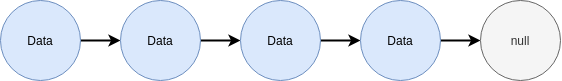

# Algorithm & CS Notes for Study

These notes are compiled from the [video](https://www.youtube.com/watch?v=RBSGKlAvoiM) from [freeCodeCamp.org](https://www.freecodecamp.org), [geeksforgeeks](https://www.geeksforgeeks.org), and various other places.

# Table of Contents

<!-- TOC -->
- [Abstract Data Type](#abstract-data-type)
    - [What is an Abstract Data Type?](#what-is-an-abstract-data-type)
    - [Examples](#examples)
- [Computational Complexity Analysis](#computational-complexity-analysis)
    - [Big-0 Notation](#big-0-notation)
    - [Big-0 Properties](#big-0-properties)
    - [Big-0 Examples](#big-0-examples)
        - [Constant Time](#constant-time)
        - [Linear Time](#linear-time)
        - [Quadratic Time](#quadratic-time)
        - [Logarithmic Time](#logarithmic-time)
        - [More Examples](#more-examples)
- [Static and Dynamic Arrays](#static-and-dynamic-arrays)
    - [What is a static array?](#what-is-a-static-array)
    - [When and where is a static Array used?](#when-and-where-is-a-static-array-used)
    - [Complexity](#complexity)
    - [Static Array](#static-array)
    - [Dynamic Array](#dynamic-array)
        - [Operations on Dynamic Arrays](#operations-on-dynamic-arrays)
        - [How can we implement a dynamic array](#how-can-we-implement-a-dynamic-array)
        - [Dynamic Array Source Code](#dynamic-array-source-code)
- [Singly and Doubly Linked Lists](#singly-and-doubly-linked-lists)
    - [What is a linked list?](#what-is-a-linked-list)
    - [Where are linked lists used?](#where-are-linked-lists-used)
    - [Terminology](#terminology)
    - [Singly vs Doubly Linked Lists](#singly-vs-doubly-linked-lists)
    - [Pros and Cons](#pros-and-cons)
    - [Inserting Singly Linked List](#inserting-singly-linked-list)
    - [Inserting Doubly Linked List](#inserting-doubly-linked-list)
<!-- /TOC -->


## Abstract Data Type

### What is an Abstract Data Type?

An `abstract data type` (ADT) is an abstraction of a data structure which provides only the interface to which a data structure must adhere to.

The interface does not give any specific details about how something should be implemented or in what programming language.

### Examples

| Abstraction (ADT) |                        Implementation (DS)                        |
|:-----------------:|:-----------------------------------------------------------------:|
|        List       |                    Dynamic Array<br>Linked List                   |
|       Queue       | Linked List based Queue<br>Array based Queue<br>Stack based Queue |
|        Map        |                 Tree Map<br>Hash Map / Hash Table                 |
|      Vehicle      |                 Golf Card<br>Bicycle<br>Smart Car                 |
|                   |                                                                   |


<br/>
<div align="right">
    <b><a href="#----">↥ back to top</a></b>
</div>
<br/>

## Computational Complexity Analysis

As programmers, we often find ourselves asking the same two questions over and over again:

* How much `time` does this algorithm need to finish?
* How much `space` does this algorithm need for its computation?

### Big-0 Notation

Big-0 Notation gives an upper bound of the complexity in the `worst` case, helping to quantify performance as the input size becomes `arbitrarily large`.

n - The size of the input

Complexities ordered in from smallest to largest

| Name              | Formula        |
|-------------------|----------------|
| Constant Time     | `0(1)`         |
| Logarithmic Time  | `0(log(n))`    |
| Linear Time       | `0(n)`         |
| Linearithmic Time | `0(nlog(n))`   |
| Quadric Time      | `0(n²)`        |
| Cubic Time        | `0(n³)`        |
| Exponential Time  | `0(bⁿ)`, b > 1 |
| Factorial Time    | `0(n!)`        |
|                   |                |

### Big-0 Properties

```go
0(n + c) = 0(n)
    0(cn) = 0(n), c > 0
```

Let `f` be a function that describes the running time of a particular algorithm for an input of size `n`:

```go
f(n) = 7log(n)³ + 15n² + 2n³ + 8

        0(f(n)) = 0(n³)
```

### Big-0 Examples

#### Constant Time

The following run in <ins>constant</ins> time: `0(1)`

```go
a := 1          i := 0
b := 2          While i < 11 Do
c := a + 5*b        i = i + 1
```

Both sides run in constant time because they do not depend on `n` at all.

So on the left when we are just adding or doing some mathmatical formula, yes, that is constant time.

And on the right, we are doing a loop, but the loop itself does not depend on `n`, so it runs also in a constant amount of time. So as our input size gets arbituary large, well that loop is still going to run in the same amount of time regardless.

#### Linear Time

The following run in <ins>linear</ins> time: `0(n)` with respect to the input size of `n` because we do a constant amount of work in `n` times

```go
i := 0              i := 0
While i < n Do      While i < n Do
    i = i + 1           i = i + 3

    f(n) = n            f(n) = n/3
  0(f(n)) = 0(n)      0(f(n)) = 0(n)
```

#### Quadratic Time

Both of the following run in quadratic time. The first may be obvious since *n* work done *n* times is *n\*n* = `0(n²)`, but what about the second one?

```go
For (i := 0 ; i < n; i = i + 1)
    For (j := 0 ; j < n; j = j + 1)

  f(n) = n*n = n², 0(f(n)) = 0(n²)

For (i := 0 ; i < n; i = i + 1)
    For (j := i ; j < n; j = j + 1)
              ^ replaced 0 with i
```

For a moment just focus on the second loop. Since *i* goes from [0, n] the amount of looping done is directly determined by what *i* is. Remark that if *i=0*, we do *n* work, if *i=1*, we do *n-1* work, if *i=2*, we do *n-2* work, etc...

So the question then becomes what is:
*(n) + (n-1) + (n-2) + (n-3) + ... + 3 + 2 + 1*?

Remarkably this turns out to be *n(n+1)/2*, so 0(n(n+1)/2) = 0(n²/2 + n/2) = `0(n²)`

```go
For (i := 0 ; i < n; i = i + 1)
    For (j := i ; j < n; j = j + 1)
```

#### Logarithmic Time

Suppose we have a sorted array and we want to find the index of a particular value in the array, if it exists. What is the time complexity of the following algorithm?

```go
low := 0            Ans: 0(log₂(n)) = 0(log(n))
high := n-1
While low <= high Do

    mid := (low + high) / 2

    If array[mid] == value: return mid
    Else If array[mid] < value: lo = mid + 1
    Else If array[mid] > value: hi = mid - 1

return -1 // Value not found
```

#### More Examples

```go
i := 0
While i < n Do
    j = 0
    While j < 3*n Do
        j = j + 1
    j = 0
    While j < 2*n Do
        j = j + 1
    i = i + 1

f(n) = n * (3n + 2n) = 5n²
      0(f(n)) = 0(n²)
```

```go
i := 0
While i < 3 * n Do
    j := 10
    While j <= 50 Do
        j = j + 1
    j = 0
    While j < n*n*n Do
        j = j + 2
    i = i + 1

f(n) = 3n * (40 + n³) = 3n/40 + 3n⁴/2
            0(f(n)) = 0(n⁴)
```

Other classic examples of Big-0:

* Finding all subsets of a set - `0(2ⁿ)`
* Finding all permutations of a string - `0(n!)`
* Sorting using mergesort - `0(nlog(n))`
* Iterating over all the cells in a matrix of size n by m - `0(nm)`

<br/>
<div align="right">
    <b><a href="#----">↥ back to top</a></b>
</div>
<br/>

## Static and Dynamic Arrays

Probably the most **used** data structure. The reason the array is used so much is because it forms the fundamental building block for all other data structures. So we end up seeing it everywhere. With arrays and pointers we can construct just about any data structure.

### What is a static array?

A static array is a fixed length container containing n elements `indexable` from the range [0, n-1].

**Q:** What is meant by being `indexable`?

**A:** This means that each slot/index in the array can be referenced with a number.

Static arrays are given as contiguous chunks of memory. Meaning, that your chunk of memory doesn't look like a piece of Swiss cheese with a bunch of holes and gaps. It's contiguous, all the addresses are adjacent in your static array.

### When and where is a static Array used?

* Storing and accessing sequential data
* Temporarily storing objects
* Used by IO routines as buffers
* Lookup tables and inverse lookup tables
* Can be used to return multiple values from a function
* Used in dynamic programming to cache answers to subproblems

### Complexity

|           | Static Array | Dynamic Array |
|-----------|--------------|---------------|
| Access    | 0(1)         | 0(1)          |
| Search    | 0(n)         | 0(n)          |
| Insertion | N/A          | 0(n)          |
| Appending | N/A          | 0(1)          |
| Deletion  | N/A          | 0(n)          |
|           |              |               |

So the access time for static and dynamic Array is constant because of the property that the Arrays are indexing.

Searching however, can take up to linear time because we potentially have to traverse all the elements of the Array in the worst case, such as, the element in the Array we are searching for does not exist.

Inserting, appending, and deletion in a static Array really doesn't make sense. The static Array is a fixed sized container. It cannot grow larger or smaller. When inserting in a dynamic Array, this operation can cost up to linear time because you potentially have to shift all the elements to the right and recopy all the elements into the new static array. This is assuming we are implementing a dynamic Array using a static Array. Appending though, is constant. When we append elements to a dynamic Array, we have to resize the internal static Array containing all those elements. This happens so rarely that appending becomes constant time. Deletions are linear for the same reasons that insertions are linear. You have to shift all the elements over and re-potentially re-copy everything to your static Array.

### Static Array


Elemetns in *A* are referenced by their index. There is no other way to access elements in an array. Array indexing is zero-based, meaning the first element is found in position zero.


### Dynamic Array

#### Operations on Dynamic Arrays

The dynamic array can `grow` and `shrink` in size.


#### How can we implement a dynamic array

**A:** One way is to use a static array!

* Create a static array with an initial capacity.
* Add elements to the underlying static array, keeping track of the number of elements.
* If adding another element will exceed the capacity, then create a new static array with twice the capacity and copy the original elements into it.

Suppose we create a dynamic array with an initial capacity of two and then begin adding elements to it.


`∅` is a placeholder for an empty position.

* We add `7` and everything is fine.
* We add `-9` and everything is fine.
* But once we add `3` it doesn't fit in our internal static array, so we double the size of our array, copy all the elements in, and now we can add `3`.
* Now if we add `12`, everything is still fine.
* And if we add `5`, we have to do a resize again, copy the elements into the larger array and add finish adding `5`.
* And lastly add `6` with no issues.
* And still have two remaining slots left of the array.

#### Dynamic Array Source Code

[Dynamic Array in Python](./Data_Structures/Dynamic_Array/DynamicArray.py)

Simply run

```py
python3 DynamicArray.py
```

<br/>
<div align="right">
    <b><a href="#----">↥ back to top</a></b>
</div>
<br/>

## Singly and Doubly Linked Lists

### What is a linked list?

A linked list is a sequential list of nodes that hold data which point to other nodes also containing data.



### Where are linked lists used?

* Used in many List, Queue & Stack implementations.
* Great for creating circular lists.
* Can easily model real world objects such as trains.
* Used in separate chaining, which is present certain Hashtable implementations to deal with hashing collisions.
* Often used in the implementation of adjacency lists for graphs.

### Terminology

* `Head`: The first node in a linked list
* `Tail`: The last node in a linked list
* `Pointer`: Reference to another node
* `Node`: An object containing data and pointer(s)


### Singly vs Doubly Linked Lists

Singly linked lists only hold a reference to the next node. In the implementation you always maintain a reference to the `head` to the linked list and a reference to the `tail` node for quick additions/removals.


With a doubly linked list each node holds a reference to the next and previous node. In the implementation  you always maintain a reference to the `head` and the `tail` of the doubly linked list to do quick additions/removals from both ends of your list.


### Pros and Cons

Pros and Cons to a Singly and Doubly Linked list

|                  |                    Pros                    |                  Cons                    |
|:----------------:|:------------------------------------------:|:----------------------------------------:|
| Singly<br>Linked | Uses less memory<br>Simpler implementation | `Cannot easily access previous elements` |
| Doubly<br>Linked |         Can be traversed backwards         |             `Takes 2x memory`            |
|                  |                                            |                                          |

### Inserting Singly Linked List

Insert 11 where the third node is.


We first create a new pointer that points to the head. This is almost always the first step in all linked list operations.


We are going to seek up to but not including the node we want to remove. Moving the pointer to the next node after `5`, which is `23`.


And now we are already where we need to be to create the next node. So we create the next node, the green node, `11`. And we make `11`'s next node point to `7`


And then we change `23`'s next pointer to be `11`.


Remember, we have access to `23`'s next pointer because we have a reference to it with the traversing.

And now we flatten out the list, and we can see we have correctly inserted 11 at the correct position.


### Inserting Doubly Linked List

Insert `11` where the third node is.

It's a bit trickier because of all the pointers around, but it's the exact same concept as before.


Create a traversal pointer which points to where the head is, and advance it to where you are just before the insertion position.


So we are just before the node so we stop traversing. We create the new node.


Set `11`'s next pointer equal to `7` and also point `11`'s previous pointer to `23`.


Now we make `7`'s previous pointer equal to `11`. So we can go backwards from `7` to `11`.


And the last step is to make `23`'s next pointer equal to `11`.


This is so that we can go forwards from `23` to `11`. So in total, we changed exactly 4 pointers. If we flatten out the list, we can see that `11` has been inserted in the correct position.


<br/>
<div align="right">
    <b><a href="#----">↥ back to top</a></b>
</div>
<br/>